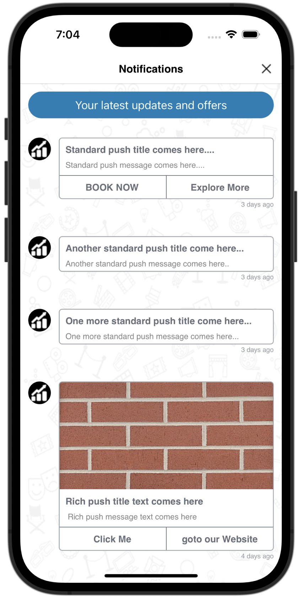
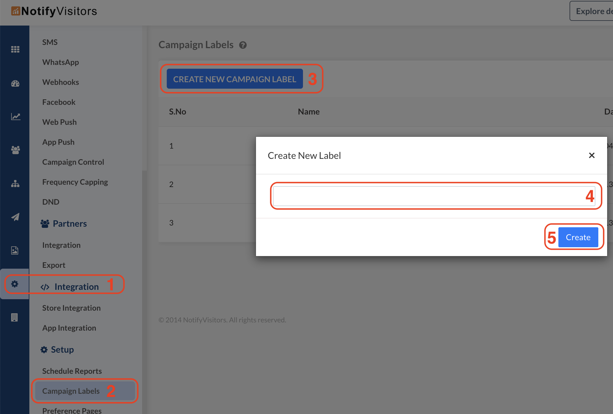
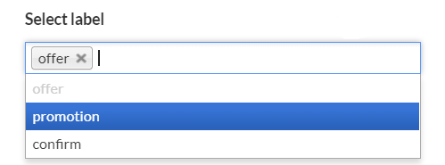
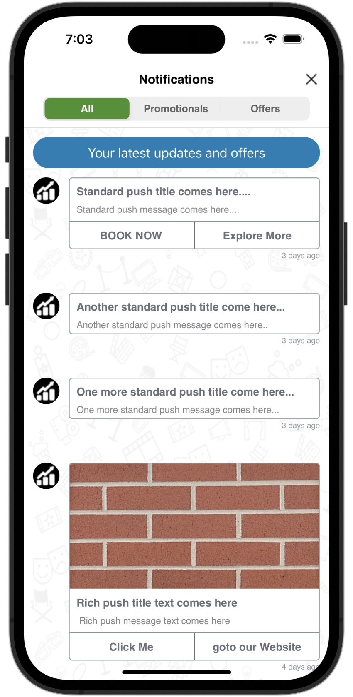
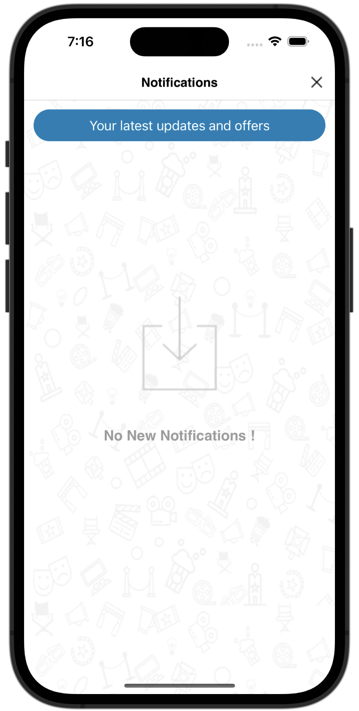

# Notification Center (App Inbox)

The Notification Center (App Inbox) allows you to display previously received push notifications inside your application.

This feature is useful when users miss notifications or want to revisit older messages. Notification expiry and categorization can be managed from the NVECTA dashboard.

Official Documentation: <br>
https://www.nvecta.com/docs/configure-notification-center-5

---

## Notification Center UI

If you want to integrate our designed notification center into your app, then you can use the code below according to your use case. If you have broadcast Push in the panel, `NVECTA` SDK offers two different types of notification center based on UI differences as described below in this documentation.

### Standard /Simple Notification Center

This will simply show you all your push notifications from the panel which you have recently sent to your users based on an expiry time. You can set the expiry time of the notifications from the panel and by default expiry set if you push notification if you have not give any while creating push notification in your panel.

#### Swift

```swift
NVECTA.shared.notificationCenter()
```

<details>
<summary>Objective-C</summary>

```objective-c
[[NVECTA shared] notificationCenter];
```

</details>

<br>

If you call the function as described above, you will get the output of the UI as shown in the following screenshot.

<p align="center">
  
</p>

<!--  -->

### Advance Notification Center (UI with Tabs)

If you are using our latest SDK version 6.1.0 or above then you can use our advanced Notification Center UI. This type of Notification center allows you to show notifications in separate tabs which will be categorized based on the label you have defined in your app as well as configured in your NVECTA dashboard.

Refer to below steps to use advanced UI in your app.

#### Step-1: Configure in NVECTA Dashboard

**a )** You need to configure labels first. In the NotifyVisitors panel, you can configure labels in the Analytics Section. Go to the Settings option from the left side menu. Another left-side menu will appear, see at the bottom of this menu, you will find Campaign Labels in the Setup section. Here you can create as many campaign labels as per your requirements.

<p align="center">
  
</p>

**b )** When creating push notifications, select the desired label in Advanced Options → Select Label. If you click here on this section, a list of all labels will appear. From this list, you can add single or multiple labels according to your requirements.

<p align="center">
  
</p>

#### Step-2: Configure in your App

Now when you have done with the NotifyVisitors panel setup for our advance notification center Ui you can now use the above configuration as a category filter in your app by using the following code.

#### Swift

```swift
/* REQUIRED 1: Initialise NVCenterStyleConfig  */

let configuration = NVECTACenterStyleConfig()

configuration.setFirstTab(label: "your_first_label", displayName: "1st tab title will be shown in app")
configuration.setSecondTab(label: "your_second_label", displayName: "2nd tab title will be shown in app")
configuration.setThirdTab(label: "your_third_label", displayName: "3rd tab title will be shown in app")

/* OPTIONAL:*/
configuration.selectedTabIndex = 0
configuration.tabTextFont = UIFont(name: "Chalkduser", size: 13)
configuration.selectedTabTextColor = .white
configuration.unselectedTabTextColor = .black
configuration.selectedTabBackgroundColor = .green
configuration.unselectedTabBackgroundColor = .lightGray

/*REQUIRED 2: Launch the Notification Center view controller with the above configuration */
NVECTA.shared.notificationCenter(with: configuration)
```

<details>
<summary>Objective-C</summary>

```objective-c
/* REQUIRED 1: Initialise NVCenterStyleConfig  */
 NVECTACenterStyleConfig *configuration = [[NVECTACenterStyleConfig alloc] init];

[configuration setFirstTabWithLable: @"your_first_label" displayName: @"1st tab title will be shown in app"];

[configuration setSecondTabWithLable: @"your_second_label" displayName: @"2nd tab title will be shown in app"];


[configuration setThirdTabWithLable: @"your_third_label" displayName: @"3rd tab title will be shown in app"];

/* OPTIONAL:*/
[configuration setSelectedTabIndex: 0];
[configuration setSelectedTabTextColor: [UIColor whiteColor]];
[configuration setUnselectedTabTextColor: [UIColor blackColor]];
[configuration setSelectedTabBackgroundColor: [UIColor redColor]];
[configuration setUnselectedTabBackgroundColor: [UIColor lightGrayColor]];

/*REQUIRED 2: Launch the Notification Center view controller with the above configuration */
[[NVECTA shared] notificationCenterWithConfiguration: configuration];
```

</details>

<br>

> ⚠️ **Important Note**
>
> - There are a maximum of 3 tabs allowed in our SDK for this type of Notification Center.
> - In the above shown example both Tab Label and Display Name both parameters are required in the given method in order to show the tab in Notification Center. If any one is nil or empty string then that tab will be skipped in the UI.
> - Tag labels passed at the app side must match (also case sensitive) with the tag labels set in your NotifyVisitors dashboard push notifications to apply filters in the Notification Center screen.
> - If you pass only one tag label and its Display Name using any method as described in above example then Tab UI will be hidden but filter will apply in the UI of Notification Center screen.

---

You can refer to the following example code for your reference.

##### Swift

```swift

/* REQUIRED 1: Initialise NVCenterStyleConfig  */
let configuration = NVECTACenterStyleConfig()

configuration.setFirstTab(label: "all", displayName: "All")
configuration.setSecondTab(label: "promotion", displayName: "Promotionals")
configuration.setThirdTab(label: "offer", displayName: "Offers")

/* OPTIONAL:*/
configuration.selectedTabIndex = 0
configuration.tabTextFont = UIFont(name: "Chalkduser", size: 13)
configuration.selectedTabTextColor = .white
configuration.unselectedTabTextColor = .black
configuration.selectedTabBackgroundColor = .green
configuration.unselectedTabBackgroundColor = .lightGray

/*REQUIRED 2: Launch the Notification Center view controller with the above configuration */
NVECTA.shared.notificationCenter(with: configuration)
```

<details>
<summary>Objective-C</summary>

```objective-c
/* REQUIRED 1: Initialise NVCenterStyleConfig  */
 NVECTACenterStyleConfig *configuration = [[NVECTACenterStyleConfig alloc] init];

[configuration setFirstTabWithLable: @"all" displayName: @"All"];
[configuration setSecondTabWithLable: @"promotion" displayName: @"Promotionals"];
[configuration setThirdTabWithLable: @"offer" displayName: @"Offers"];

/* OPTIONAL:*/
[configuration setSelectedTabTextColor: [UIColor whiteColor]];
[configuration setUnselectedTabTextColor: [UIColor blackColor]];
[configuration setSelectedTabBackgroundColor: [UIColor redColor]];
[configuration setUnselectedTabBackgroundColor: [UIColor lightGrayColor]];

/*REQUIRED 2: Launch the Notification Center view controller with the above configuration */
[[NVECTA shared] notificationCenterWithConfiguration: configuration];
```

</details>

<br>

You can refer to the following UI Sample screenshot while using Advance Notification Center UI.

<p align="center">
  
</p>

<br>

#### Default Labels ("all" and "others"):

There are two predefined labels ("all" and "others") in our SDK. Which we say as default labels which means you don’t need to configure these labels in the panel but if you want to show them in the app then you need to mention them in the function. You can check the above examples. You can refer to the following definitions of each default labels as define below.

#### all:

This label will show all the available broadcasted push notifications.

#### others:

This label will show you only those push notifications which are broadcasted and also whose tabs are not configured in the function. Which means it will show remaining notifications available which are not visible in any other tags currently visible in the Notification Center screen.

In case you don’t have any push notifications or expired to show in Notification Center, the NV-SDK will show you an empty/ no Notification screen view. Refer to the below screenshot:

<p align="center">
  
</p>

## Get Unread Notification Count

You can retrieve the unread notification count and display it on a badge, bell icon, or notification indicator.

#### Swift

```swift
let configuration = NVECTACenterStyleConfig()
configuration.setFirstTab(label: "all", displayName: "All")
configuration.setSecondTab(label: "promotion", displayName: "Promotionals")
configuration.setThirdTab(label: "offer", displayName: "Offers")

NVECTA.shared.getNotificationCenterCount(with: configuration) { (unreadCounts: [AnyHashable : Any]?) in
  //do you task here
}
```

<details>
<summary>Objective-C</summary>

```objective-c
NVECTACenterStyleConfig *configuration = [[NVECTACenterStyleConfig alloc] init];

[configuration setFirstTabWithLable: @"all" displayName: @"All"];
[configuration setSecondTabWithLable: @"promotion" displayName: @"Promotionals"];
[configuration setThirdTabWithLable: @"offer" displayName: @"Offers"];

[[NVECTA shared] getNotificationCenterCountWithConfiguration: configuration, countResult:^(NSDictionary * unreadCounts) {
     //do you task here
}];
```

</details>

### Sample Callback Response

```json
{
  "totalCount": 5,
  "tabOneCount": 3,
  "tabTwoCount": 0,
  "tabThreeCount": 2
}
```

---

<br>

## Get Notification Center Data

If you want to build your own custom App Inbox UI, you can retrieve notification data directly from the SDK.

#### Swift

```swift
NVECTA.shared.getNotificationCenterData { (notificationsData: [String : Any]?) in
  print("getNotificationCenterData response data = \(notificationsData ?? [:])")
}
```

<details>
<summary>Objective-C</summary>

```objective-c
[[NVECTA shared] getNotificationCenterData:^(NSDictionary * _Nullable notificationsData) {
    NSLog(@"getNotificationCenterData response data = %@", notificationsData);
}];
```

</details>

<br>

The callback returns notification data in JSON format, allowing you to:

- Create your own inbox UI.
- Design custom notification cards.
- Implement custom filtering and sorting.
- Build a fully branded notification center experience.

### Callback Response

```json
{
  "message": "notification(s) found",
  "notifications": [
    {
      "title": "Rich push title text comes here",
      "message": " Rich push message text comes here",
      "push_type": "image",
      "target": "0",
      "url": "dashboardViewController",
      "category": "nvpush",
      "notificationID": "152747",
      "send_time": "2020-07-31 17:30:00",
      "rich_media_url": "https:\/\/pushimages.notifyvisitors.com\/images\/push_rich_icon_75820.jpg",
      "parameters": {
        "page_id": "dashboard",
        "category": "fashion"
      },
      "cta_btnTitleOne": "Click Me",
      "cta_btnTargetOne": "0",
      "cta_btnUrlOne": "dashboardViewController",
      "time": "20 hours ago",
      "icon": "https:\/\/pushimages.notifyvisitors.com\/images\/push_icon_152747.jpg",
      "cta_btnTitleTwo": "goto our Website",
      "cta_btnTargetTwo": "1",
      "cta_btnUrlTwo": "https:\/\/www.notifyvisitors.com"
    }
  ]
}
```

In case, when you have no broadcasted push in the panel.

```json
{
  "message": "no notification(s)",
  "notifications": []
}
```

---

<br>

## Notification Categories

Notifications can be organized into multiple tabs using labels configured in the NVECTA dashboard.

Example categories:

```text
Offers
Promotions
Announcements
Updates
Transactions
```

Users can switch between tabs to view notifications belonging to specific categories.

---

<br>

## Common Use Cases

### Show Notification History

Allow users to revisit notifications they may have dismissed.

### Inbox Screen

Create a dedicated "Inbox" section within your app.

### Notification Badge

Display unread notification count on:

- Bell icons
- Navigation tabs
- Profile sections
- Dashboard widgets

### Custom Inbox UI

Use `getNotificationCenterData()` to build a completely custom notification center matching your application's design.

<br>

## Best Practices

- Create meaningful notification categories.
- Use unread counts to improve engagement.
- Keep important notifications available in the inbox even after dismissal.
- Use a custom inbox UI when you need complete control over the user experience.
- Configure notification expiry from the NVECTA dashboard to prevent outdated messages from appearing.

### Recommended Flow

```text
Push Notification Received
            │
            ▼
      Stored in Inbox
            │
            ▼
 User Opens App Inbox
            │
            ├── View Notifications
            ├── Filter by Category
            ├── Check Unread Count
            └── Open Notification Details
```

The Notification Center provides a persistent in-app repository of push notifications, ensuring users can access important messages even after they have been dismissed from the device notification tray.
