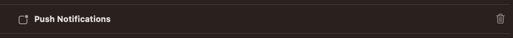
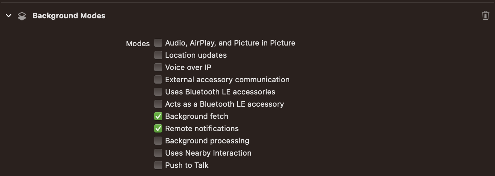

# Push Notifications (iOS)

This guide explains how to configure Push Notifications for the NVECTA iOS SDK into your iOS App.

**Official Documentation**
https://www.nvecta.com/docs/ios-push-notifications

---

## Overview

This guide covers:

- APNs configuration
- Registering for push notifications
- Configuring Xcode capabilities
- Handling notification callbacks
- Rich notifications using Notification Service Extension

## Prerequisites

Before proceeding, ensure that:

- The NVECTA iOS SDK has been integrated successfully.
- Your iOS application is configured and builds successfully.
- You have access to your Apple Developer Account.
- You have access to the NVECTA Dashboard.

## 1. Configure APNs in the NVECTA Dashboard

Before configuring your application, upload your Apple Push Notification credentials to the NVECTA Dashboard.

### Generate an APNs Authentication Key

Create an APNs Authentication Key (`.p8`) from your Apple Developer account.

For detailed instructions, refer to:

- [APNs Auth Keys](https://www.nvecta.com/docs/apns-auth-keys)

### Upload the APNs Authentication Key

In the NVECTA Dashboard:

```
Settings
    └── App Push
            └── iOS
```

Configure the following:

- Enable Push Notifications
- Select **APNs Auth Key** as the authentication type
- Upload the generated `.p8` file
- Enter the required Apple Developer credentials
- Save the configuration

> **Important**
>
> Ensure that all Apple Developer credentials are entered exactly as provided. Incorrect values may prevent push notifications from being delivered.

## 2. Configure Push Notifications in Your App

The iOS application must:

- Register for remote notifications
- Enable Push Notification capabilities
- Forward notification delegates to the SDK
- Configure a Notification Service Extension (recommended)

### 2.1 Register for Push Notifications

Import the User Notifications framework and adopt the `UNUserNotificationCenterDelegate` protocol.

#### Swift

```swift
import UserNotifications

@main
class AppDelegate: UIResponder, UIApplicationDelegate, UNUserNotificationCenterDelegate {
```

<details>
<summary>Objective-C</summary>

```objective-c
#import <UserNotifications/UserNotifications.h>

@interface AppDelegate () <UNUserNotificationCenterDelegate>
@end
```

</details>

<br>

After initializing the SDK in `didFinishLaunchingWithOptions`, register for push notifications.

#### Swift

```swift
UNUserNotificationCenter.current().delegate = self

NVECTA.shared.registerPush(delegate: self, application: application, launchOptions: launchOptions)
```

<details>
<summary>Objective-C</summary>

```objective-c
[UNUserNotificationCenter currentNotificationCenter].delegate = self;

[[NVECTA shared] registerPushWithDelegate: self application: application launchOptions: launchOptions];
```

</details>

### Forward APNs Registration Callbacks

Forward the following callbacks to the SDK.

#### Swift

```swift
func application(
    _ application: UIApplication,
    didRegisterForRemoteNotificationsWithDeviceToken deviceToken: Data
) {
    NVECTA.shared.didRegisterPushToken(application, token: deviceToken)
}

func application(
    _ application: UIApplication,
    didFailToRegisterForRemoteNotificationsWithError error: Error
) {
    print("push registration failed due to the following error = \(error)" )
}
```

<details>
<summary>Objective-C</summary>

```objective-c
- (void)application:(UIApplication *)application
didRegisterForRemoteNotificationsWithDeviceToken:(NSData *)deviceToken {
[[NVECTA shared] didRegisterPushTokenForApplication: application token: deviceToken];
}

- (void)application:(UIApplication *)application
didFailToRegisterForRemoteNotificationsWithError:(NSError *)error {
     NSLog(@"push registration failed due to the following error = \(error)" );
}
```

</details>

### 2.2 Configure Xcode Capabilities

Open your iOS project in Xcode and select:

```
YouAppMainTarget
    └── Signing & Capabilities
```

Enable the following capabilities:

### a) Push Notifications

Add the **Push Notifications** capability if it is not already enabled.


### b) Background Modes

Enable **Background Modes** and select:

- Background fetch
- Remote notifications



These capabilities are required for reliable push notification delivery and background processing.

### 2.3 Forward Notification Delegates

Forward all notification callbacks to the SDK.

#### Swift

```swift
func userNotificationCenter(
    _ center: UNUserNotificationCenter,
    willPresent notification: UNNotification,
    withCompletionHandler completionHandler: @escaping (UNNotificationPresentationOptions) -> Void
) {
    NVECTA.shared.willPresent(notification, completion: completionHandler)
}

func application(
    _ application: UIApplication,
    didReceiveRemoteNotification userInfo: [AnyHashable : Any],
    fetchCompletionHandler completionHandler: @escaping (UIBackgroundFetchResult) -> Void
) {
    NVECTA.shared.didReceiveRemoteNotification(userInfo, fetchCompletionHandler: completionHandler)
}

func userNotificationCenter(
    _ center: UNUserNotificationCenter,
    didReceive response: UNNotificationResponse,
    withCompletionHandler completionHandler: @escaping () -> Void
) {
    NVECTA.shared.handleNotificationResponse(response, autoRedirect: true) { (pushResponse: NotificationClickResponse?) in
            print("pushData for further action = \(String(describing: pushResponse))")

            /* Here the data received in the pushData variable is required to execute further action and redirect to the desired ViewController. When the target is set to NavigateInApp or Universal Link, those conditions must be handled from here by using target values 0 and 6, respectively.

            If the second parameter for "autoRedirectOtherApps" is false, all push click actions must be handled from here by using pushData values, whereas if true, only NavigateInApp (target = 0) and Universal link (target = 6) values should be handled from here. */
            completionHandler()
    }
}
```

<details>
<summary>Objective-C</summary>

```objective-c
- (void)userNotificationCenter:(UNUserNotificationCenter *)center
       willPresentNotification:(UNNotification *)notification
         withCompletionHandler:(void (^)(UNNotificationPresentationOptions))completionHandler {

     [[NVECTA shared] willPresentNotification: notification withCompletionHandler: completionHandler];
}

- (void)application:(UIApplication *)application
didReceiveRemoteNotification:(NSDictionary *)userInfo
fetchCompletionHandler:(void (^)(UIBackgroundFetchResult))completionHandler {

[[NVECTA shared] didReceiveRemoteNotification: userInfo fetchCompletionHandler: completionHandler];

}

- (void)userNotificationCenter:(UNUserNotificationCenter *)center
didReceiveNotificationResponse:(UNNotificationResponse *)response
         withCompletionHandler:(void (^)(void))completionHandler {

      [[NVECTA shared] handleNotificationResponse: response autoRedirect: true completion:^(NotificationClickResponse * pushResponse) {
        NSLog(@"pushData for further action = %@", pushResponse);

        /* Here the data received in the pushData variable is required to execute further action and redirect to the desired ViewController. When the target is set to NavigateInApp or Universal Link, those conditions must be handled from here by using target values 0 and 6, respectively.

        If the second parameter for "autoRedirectOtherApps" is false, all push click actions must be handled from here by using pushData values, whereas if true, only NavigateInApp (target = 0) and Universal link (target = 6) values should be handled from here. */

        completionHandler();
      }];
}
```

</details>

## 3. Enable Rich Notifications (Recommended)

By default, iOS displays only the notification title and body.

To enable advanced notification features such as:

- Images
- Audio
- Video
- Action Buttons
- Badge Count Updates
- Delivery Tracking

configure a **[Notification Service Extension](./NotificationServiceExtension.md)** together with an **App Group**.

Refer to the dedicated [Notification Service Extension](./NotificationServiceExtension.md) guide for complete setup instructions.

## 4. Verify Integration

After completing the configuration:

- Build and run the application.
- Accept the notification permission prompt.
- Confirm that the device is successfully registered with APNs.
- Send a test push notification from the NVECTA Dashboard.
- Verify that notifications are received on the device.
- [**Validate push**](https://support.nvecta.com/support/solutions/articles/84000399426-test-push-notifications) registration, push delivery, and click tracking are working correctly by sending a test push notification

<br>

If Rich Notifications are configured, verify that images, action buttons, and delivery tracking work as expected.

# Support

If you encounter any issues during integration:

- Contact the NVECTA Support Team.
- Raise a support request from the NVECTA Dashboard.
