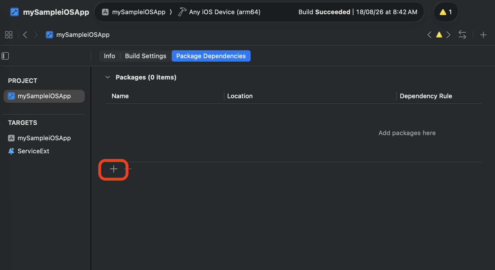
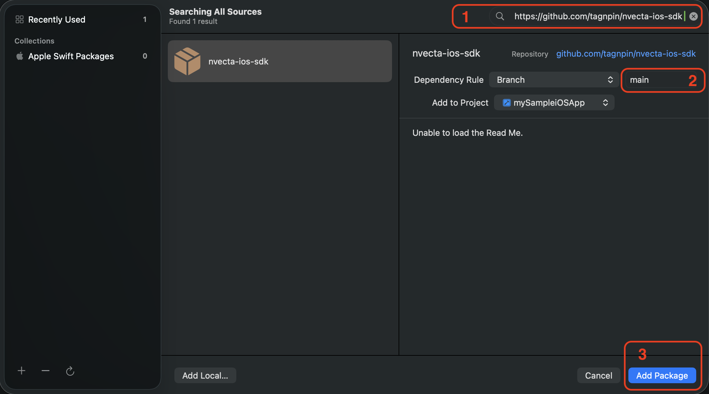
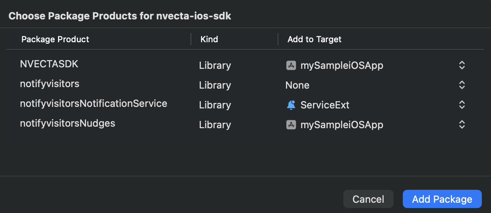

# NVECTA iOS SDK

[](http://cocoapods.org/pods/notifyvisitors)
[](http://cocoapods.org/pods/notifyvisitors)

[](https://swift.org/package-manager/)
[](https://notifyvisitors.com/)

## 🚀 Quick Introduction

The NVECTA iOS SDK helps you integrate powerful customer engagement and analytics features into your native iOS mobile applications. With NVECTA, you can track user activity, send personalized notifications, and improve user engagement through real-time insights and communication tools.

To learn more, visit our [website](https://www.nvecta.com/) and explore the [documentation](https://www.nvecta.com/docs/getting-started-2) for installation and setup guidance.

Ready to get started? [Sign up here](https://console.notifyvisitors.com/console/account/login) to create your account.

## 📋 Requirements

- iOS 13.0 or later
- Xcode 26.0 or later
- Use a version of Xcode that supports the Swift Package Manager tools version declared by the package.

  The current package uses:

  ```text
    Swift Package Manager tools version: 6.2
  ```

## 🎉 Installation

`NVECTA` iOS SDK can be integrated into your iOS application using `Swift Package Manager`, `CocoaPods`, or `Manual XCFramework` integration.

### Recommended: Swift Package Manager

NVECTA iOS SDK is distributed as a binary Swift Package through `Swift Package Manager (SPM)`.

#### 1. Add NVECTA iOS SDK

Open your iOS application in Xcode.

From the Xcode menu, select:

- **File → Add Package Dependencies...**

<p align="center">
  
</p>

- Enter the NVECTA iOS SDK GitHub repository URL:

  ```text
      https://github.com/tagnpin/nvecta-ios-sdk
  ```

    <p align="center">
      
    </p>

- **Assign Packages:** Assign the package as per our recommended configration as shown in the table given below.

    <table>
    <thead>
    <tr>
    <th>Package</th>
    <th style="text-align: center;">Target</th>
    <th style="text-align: center;">Required</th>
    <th style="text-align: center;">Remarks</th>
    </tr>
    </thead>
    <tbody>
    <tr>
    <td><code>NVECTASDK</code></td>
    <td style="text-align: center;">Main App</td>
    <td style="text-align: center;">✅</td>
    <td style="text-align: center;">-</td>
    </tr>
    <tr>
    <td><code>notifyvisitors</code></td>
    <td style="text-align: center;">  Main App</td>
    <td style="text-align: center;">Optional</td>
    <td style="text-align: center;">required only if you are still using <code>notifyvisitors</code></td>
    </tr>
    <tr>
    <td>
    <code>notifyvisitorsNotificationService</code></td>
    <td style="text-align: center;">Notification Service Extension</td>
    <td style="text-align: center;">✅</td>
    <td style="text-align: center;">-</td>
    </tr>
    <tr>
    <td><code>notifyvisitorsNudges</code></td>
    <td style="text-align: center;">Main App</td>
    <td style="text-align: center;">Recommended</td>
    <td style="text-align: center;"> if you are using inApp-nudges (for exampele: pip video or native display)</td>
    </tr>
    </tbody>
    </table>

    <br>

- Click `Add Package` and ensure that the NVECTA iOS SDK has been added to the appropriate target. Recommended selection configration is shown in the screenshot below.

    <p align="center">
      
    </p>

<br>

### Other Installation Methods

<details>
<summary><strong>1. CocoaPods</strong></summary>

[CocoaPods Installation:](./Documentation/Installation/CocoaPods.md) Install `notifyvisitors` iOS SDK using CocoaPods.

</details>

<details>
<summary><strong>2. Manual Installation</strong></summary>

[Manual Installation:](./Documentation/Installation/Manual.md) Integrate the SDK by manually adding the required XCFrameworks to your project.

</details>

<br>

> **Recommendation:**
>
> New integrations should use `Swift Package Manager`. Existing applications using `CocoaPods` or `manual XCFramework` integration are encouraged to migrate to `Swift Package Manager`.

Choose the installation method that best matches your project's dependency management strategy.

## 📦 Integrate NVECTA into Your iOS App

After installing the SDK, complete the following configuration steps.

### 1. Configure Info.plist

Open **Info.plist** and add the following keys.

```xml
<key>CFBundleURLTypes</key>
  <array>
        <dict>
            <key>CFBundleURLName</key>
     	        <string>$(PRODUCT_BUNDLE_IDENTIFIER)</string>
            <key>CFBundleURLSchemes</key>
             	<array>
                    <string>YOUR_CUSTOM_URL_SCHEME_COMES_HERE</string>
                </array>
     	</dict>
    </array>

<key>nvBrandID</key>
    <integer>YOUR_NVECTA_BRAND_ID</integer>

<key>nvSecretKey</key>
    <string>YOUR_NVECTA_BRAND_SECRET_KEY</string>

<key>nvPushCategory</key>
    <string>nvpush</string>

<key>nvViewAutoRedirection</key>
    <true/>
```

#### SDK Configuration

| Key                     | Type    | Description                                                   |
| ----------------------- | ------- | ------------------------------------------------------------- |
| `CFBundleURLTypes`      | Array   | Configures the custom URL scheme used for deep-link handling. |
| `nvBrandID`             | Number  | Your NVECTA `BrandID`                                         |
| `nvSecretKey`           | String  | Your NVECTA `Secret Key`                                      |
| `nvPushCategory`        | String  | Push NVECTA category. Use the default value: `nvpush`.        |
| `nvViewAutoRedirection` | Boolean | Enables automatic view redirection when configured properly.  |

> **Tip**
>
> You can edit `Info.plist` either as a **Property List** or as **Source Code**. Both approaches produce the same result.

> **Important**
>
> **Replace** the `YOUR_NVECTA_BRAND_ID` and `YOUR_NVECTA_BRAND_SECRET_KEY` values above with your actual `BrandID` and `Encryption Key` available from your `NVECTA` Dashboard.

<br>

## 🔑 Where can I find my `BrandID` and `Encryption Key`?

Replace `YOUR_NVECTA_BRAND_ID` and `YOUR_NVECTA_BRAND_SECRET_KEY` with your actual NVECTA credentials.

You can obtain these credentials in one of the following ways:

- Retrieve them yourself from the **NVECTA Dashboard**.

**📍 NVECTA Dashboard**  
https://console.notifyvisitors.com/brand/admin/integration_javaScriptCode?active_tab=direct_integration

**📖 Detailed Guide**  
https://support.nvecta.com/support/solutions/articles/84000395836-how-to-get-brand-id-encryption-key-and-api-keys-in-nvecta

<br>

---

### 2. Configure AppDelegate

The SDK uses iOS application lifecycle callbacks to support:

- SDK Initialisation and lifecycle management
- Session tracking
- Analytics
- Deep-link handling

#### Import NVECTA SDK

Import NVECTASDK in every class file where you need to access any function from the NVECTA iOS SDK.

##### Swift

```swift
import UIKit
import NVECTASDK
```

<details>
<summary>Objective-C</summary>

```objective-c
#import "AppDelegate.h"
#import <NVECTASDK/NVECTASDK-Swift.h>
```

</details>

#### Initialize NVECTA SDK

Initialize the SDK in your `AppDelegate`file and forward the following app lifecycle delegate from your `AppDelegate`.

### Swift

```swift
import UIKit
import NVECTASDK

@main
class AppDelegate: UIResponder, UIApplicationDelegate {

    func application(_ application: UIApplication, didFinishLaunchingWithOptions launchOptions [UIApplication.LaunchOptionsKey: Any]?) -> Bool {

        var nvMode:String? = nil

         #if DEBUG
             nvMode = "debug"
         #else
             nvMode = "live"
        #endif

        NVECTA.shared.register(mode: nvMode!)

        return true
    }

    override func applicationDidEnterBackground(
        _ application: UIApplication
    ) {
       NVECTA.shared.applicationDidEnterBackground(application)
    }

    override func applicationWillEnterForeground(
        _ application: UIApplication
    ) {
       NVECTA.shared.applicationWillEnterForeground(application)
    }

    override func applicationDidBecomeActive(
        _ application: UIApplication
    ) {
        NVECTA.shared.applicationDidBecomeActive(application)
    }

    override func applicationWillTerminate(
        _ application: UIApplication
    ) {
       NVECTA.shared.applicationWillTerminate(application)
    }

    override func application(
        _ app: UIApplication,
        open url: URL,
        options: [UIApplication.OpenURLOptionsKey : Any] = [:]
    ) -> Bool {

        NVECTA.shared.application(app, open: url, options: options)

        return true
    }
}
```

<details>
<summary>Objective-C</summary>

```objective-c
#import "AppDelegate.h"
#import <NVECTASDK/NVECTASDK-Swift.h>

@implementation AppDelegate

- (BOOL)application:(UIApplication *)application
didFinishLaunchingWithOptions:(NSDictionary *)launchOptions {
    NSString *nvMode = nil;

    #if DEBUG
       nvMode = @"debug";
    #else
       nvMode = @"live";
    #endif

    [[NVECTA shared] register: nvMode];

    return YES;
}

- (void)applicationDidEnterBackground:(UIApplication *)application {
    [[NVECTA shared] applicationDidEnterBackground:application];
}

- (void)applicationWillEnterForeground:(UIApplication *)application {
    [[NVECTA shared] applicationWillEnterForeground:application];
}

- (void)applicationDidBecomeActive:(UIApplication *)application {
    [[NVECTA shared] applicationDidBecomeActive:application];
}

- (void)applicationWillTerminate:(UIApplication *)application {
    [[NVECTA shared] applicationWillTerminate: application];
}

- (BOOL)application:(UIApplication *)app
            openURL:(NSURL *)url
            options:(NSDictionary<UIApplicationOpenURLOptionsKey,id> *)options {

    [[NVECTA shared] openUrl:app openURL:url options: options];

    return YES;
}

@end

```

</details>

### Lifecycle Methods

| Method                             | Description                                                          |
| ---------------------------------- | -------------------------------------------------------------------- |
| `register()`                       | Initializes the SDK.                                                 |
| `applicationDidEnterBackground()`  | Notifies the SDK when the application enters the background.         |
| `applicationWillEnterForeground()` | Notifies the SDK when the application returns to the foreground.     |
| `applicationDidBecomeActive()`     | Starts or resumes SDK session tracking.                              |
| `applicationWillTerminate()`       | Allows the SDK to perform cleanup before the application terminates. |
| `openUrl()`                        | Handles custom URL schemes and deep links.                           |

> **Note**
>
> These lifecycle callbacks are required for proper SDK functionality, including analytics, session tracking, and deep-link processing. If your application uses `SceneDelegate`, some application lifecycle events are handled by the scene lifecycle methods instead of the corresponding `AppDelegate` methods. See the next section for the required configuration.

---

### 3. Configure SceneDelegate

If your application uses Apple's `SceneDelegate` architecture, some lifecycle and URL events are delivered through `SceneDelegate` instead of `AppDelegate`.

In this case, forward the corresponding scene lifecycle callbacks to the NVECTA SDK.

> **Important**
>
> Do not implement duplicate lifecycle handling in both `AppDelegate` and `SceneDelegate` unless your application architecture specifically requires it. Forward each event from the lifecycle component that receives it.

### Swift

```swift
import UIKit
import NVECTASDK

class SceneDelegate: UIResponder, UIWindowSceneDelegate {

    var window: UIWindow?


    func scene(_ scene: UIScene, willConnectTo session: UISceneSession, options connectionOptions: UIScene.ConnectionOptions) {
        guard let _ = (scene as? UIWindowScene) else { return }
        NVECTA.shared.scene(scene, willConnectTo: session, options: connectionOptions)
    }

    func sceneDidBecomeActive(_ scene: UIScene) {
        NVECTA.shared.sceneDidBecomeActive(scene)
    }

    func sceneWillEnterForeground(_ scene: UIScene) {
        NVECTA.shared.sceneWillEnterForeground(scene)
    }

    func sceneDidEnterBackground(_ scene: UIScene) {
        NVECTA.shared.sceneDidEnterBackground(scene)
    }

    func scene(_ scene: UIScene, openURLContexts URLContexts: Set<UIOpenURLContext>) {
        NVECTA.shared.scene(scene, openURLContexts: URLContexts)
    }

}
```

<details>
<summary>Objective-C</summary>

```objective-c
#import "SceneDelegate.h"
#import <NVECTASDK/NVECTASDK-Swift.h>

@implementation SceneDelegate


- (void)scene:(UIScene *)scene willConnectToSession:(UISceneSession *)session options:(UISceneConnectionOptions *)connectionOptions  API_AVAILABLE(ios(13.0)){

    [[NVECTA shared] scene: scene willConnectToSession: session options: connectionOptions];
}

- (void)sceneDidBecomeActive:(UIScene *)scene  API_AVAILABLE(ios(13.0)){

    [[NVECTA shared] sceneDidBecomeActive: scene];
}

- (void)sceneWillEnterForeground:(UIScene *)scene  API_AVAILABLE(ios(13.0)){
    [[NVECTA shared] sceneWillEnterForeground: scene];
}

- (void)sceneDidEnterBackground:(UIScene *)scene  API_AVAILABLE(ios(13.0)){
    [[NVECTA shared] sceneDidEnterBackground: scene];
}

- (void)scene:(UIScene *)scene openURLContexts:(NSSet<UIOpenURLContext *> *)URLContexts  API_AVAILABLE(ios(13.0)){
    [[NVECTA shared] scene: scene openURLContexts: URLContexts];
}

@end
```

</details>

### Lifecycle Methods (SceneDelegate)

| Method                            | Description                                                                                                                           |
| --------------------------------- | ------------------------------------------------------------------------------------------------------------------------------------- |
| `scene(_:willConnectTo:options:)` | Notifies the SDK when a scene is connected and provides the initial scene connection options, including URL or deep-link information. |
| `sceneDidEnterBackground()`       | Notifies the SDK when the application enters the background.                                                                          |
| `sceneWillEnterForeground()`      | Notifies the SDK when the application returns to the foreground.                                                                      |
| `sceneDidBecomeActive()`          | Starts or resumes SDK session tracking.                                                                                               |
| `scene(_:openURLContexts:)`       | Handles custom URL schemes and deep links.                                                                                            |

> **Note**
>
> These lifecycle callbacks are required for proper SDK functionality, including analytics, session tracking, and deep-link processing. If your application uses `SceneDelegate`, implement the required callbacks and forward the relevant events to the SDK.

---

<br>

The SDK is now initialized and ready to use.

## Integration Verification

After completing the integration, verify the `NVECTA iOS SDK` initialization from Xcode console logs. Build and run your iOS app from Xcode and check the logs in Xcode console.

Filter logs using our SDK tag:

```text
[notifyvisitors]
```

Example successful initialization logs:

```text
[notifyvisitors]-[INFO]: You are in debug mode
[notifyvisitors]-[INFO]: BrandID >>>>======>>>>> 123XX
[notifyvisitors]-[INFO]: Inside, write inAppBanner/Survey settings data finished.
```

## Recommended Checks

Verify the following after app launch:

- SDK initializes without errors
- Your actuak `BrandID` printed in logs successfully
- No crash appears in logs.

## Validation

After completing the integration, verify that the SDK is successfully communicating with `NVECTA`.

Follow the **[Integration Code and Event Validation](https://support.nvecta.com/support/solutions/articles/84000399408-integration-code-and-event-validation)** guide to confirm that:

- App sessions are visible in the `NVECTA` dashboard.
- Events are being received successfully.
- The SDK integration has been completed correctly.

## 📊 What's Next? SDK Features & Guides

Explore the following guides to learn how to use key NVECTA SDK features in your iOS application.

### 🎯 Tracking Screens

Track user screen interactions to better understand user app behavior and engagement within your application.

➡️ [View Screen Tracking Documentation](./Documentation/Features/ScreenTracking.md)

### 🔔 Push Notifications

Configure and send push notifications to re-engage users with real-time updates and personalized communication.

➡️ [View Push Notification Documentation](./Documentation/PushNotifications/PushAppConfiguration.md)

### 🎯 Tracking Events

Track user interactions and custom events to better understand user behavior and engagement within your application.

➡️ [View Event Tracking Documentation](./Documentation/Features/EventTracking.md)

### 👤 Tracking Users

Identify users, manage user profiles, and associate user activity for personalized engagement and analytics.

➡️ [View User Tracking Documentation](./Documentation/Features/UserTracking.md)

### 💬 In-App Notifications & Nudges

Display targeted in-app messages and campaigns to engage users while they are actively using the application.

➡️ [View In-App Notification Documentation](./Documentation/Features/InAppNotifications.md)

### 🎯 In-App Nudges

Guide users with contextual nudges such as embedded banners, cards, tooltips, and other native UI elements to improve engagement and conversions.

➡️ [View In-App Nudges Documentation](./Documentation/Features/InAppNudges.md)

### 📥 Notification Center

Manage and display user notifications within a centralized in-app notification center experience.

➡️ [View Notification Center Documentation](./Documentation/Features/NotificationCenter.md)

## 🎯 Migration

- [CocoaPods to Swift Package Manager](./Documentation/Migration/CocoaPodsToSPM.md)
- [Manual XCFramework to Swift Package Manager](./Documentation/Migration/ManualToSPM.md)

## Troubleshooting

- [Common Issues](./Documentation/Troubleshooting/CommonIssues.md)

## 🆕 Changelog

Refer to the NVECTA iOS SDK [Change Log](CHANGELOG.md).

## Optional IDFA / Tracking Support

`NVECTAAdTrackingSDK` is an optional binary XCFramework that provides
App Tracking Transparency (ATT) authorization and IDFA retrieval.

Applications that do not require IDFA can use `NVECTA iOS SDK` without
integrating `NVECTAAdTrackingSDK`.

For complete installation, configuration, ATT authorization modes,
IDFA behavior, privacy requirements, and troubleshooting, see:

[IDFA Tracking & Integration](./Documentation/Features/IDFATracking.md)

## ❓Questions

Need help? Contact the `NVECTA` support team directly from the `NVECTA` Dashboard for assistance with integration, configuration, or troubleshooting.
